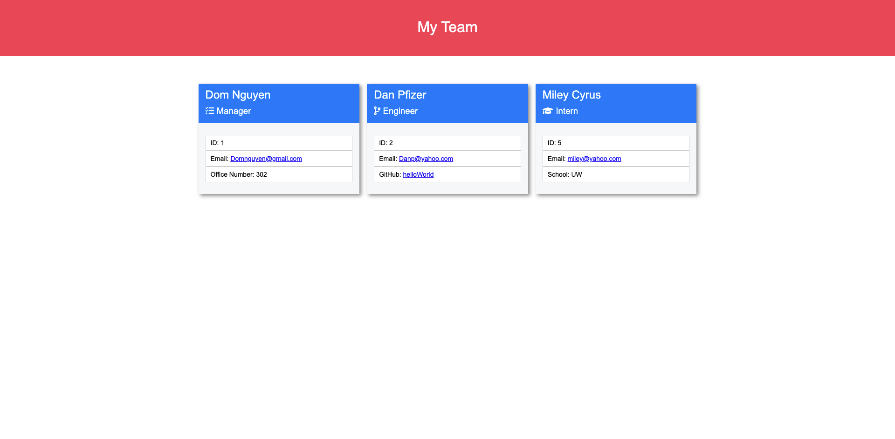

# Team Profile Manager

## Description

This is a Node.js based application built to aid a software engineering team in creating an organized list of their employees. It allows the user to create a simple webpage that lists the employees in an easy to read format. The application lists the employee's name, role, email and id along with additional information depending on the employee's role.

## Usage

[Walkthrough Video](https://youtu.be/i98aDD6u1Mc)

After proper installation (See steps below), the app can be run using `node index.js` in the command line, and then follow the prompts.

## Mockup

[Sample Generated Webpage](https://drive.google.com/file/d/17yhbgmPejW-_W9Uhfu3WxHfDGuGbNbRS/view?usp=sharing)



## User Story

```md
AS A manager
I WANT to generate a webpage that displays my team's basic info
SO THAT I have quick access to their emails and GitHub profiles
```

## Thought Process

```md
GIVEN a command-line application that accepts user input
WHEN I am prompted for my team members and their information
THEN an HTML file is generated that displays a nicely formatted team roster based on user input
WHEN I click on an email address in the HTML
THEN my default email program opens and populates the TO field of the email with the address
WHEN I click on the GitHub username
THEN that GitHub profile opens in a new tab
WHEN I start the application
THEN I am prompted to enter the team manager’s name, employee ID, email address, and office number
WHEN I enter the team manager’s name, employee ID, email address, and office number
THEN I am presented with a menu with the option to add an engineer or an intern or to finish building my team
WHEN I select the engineer option
THEN I am prompted to enter the engineer’s name, ID, email, and GitHub username, and I am taken back to the menu
WHEN I select the intern option
THEN I am prompted to enter the intern’s name, ID, email, and school, and I am taken back to the menu
WHEN I decide to finish building my team
THEN I exit the application, and the HTML is generated
```

## Installation

You will need Node.js installed on your local machine to run this app.
Before use, run `npm install` to load any dependencies to the folder.


